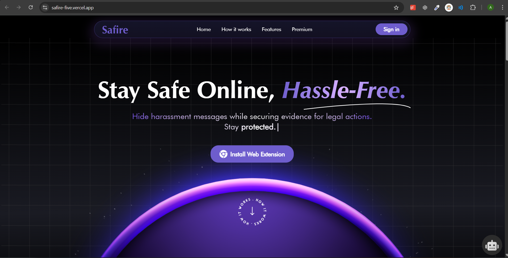
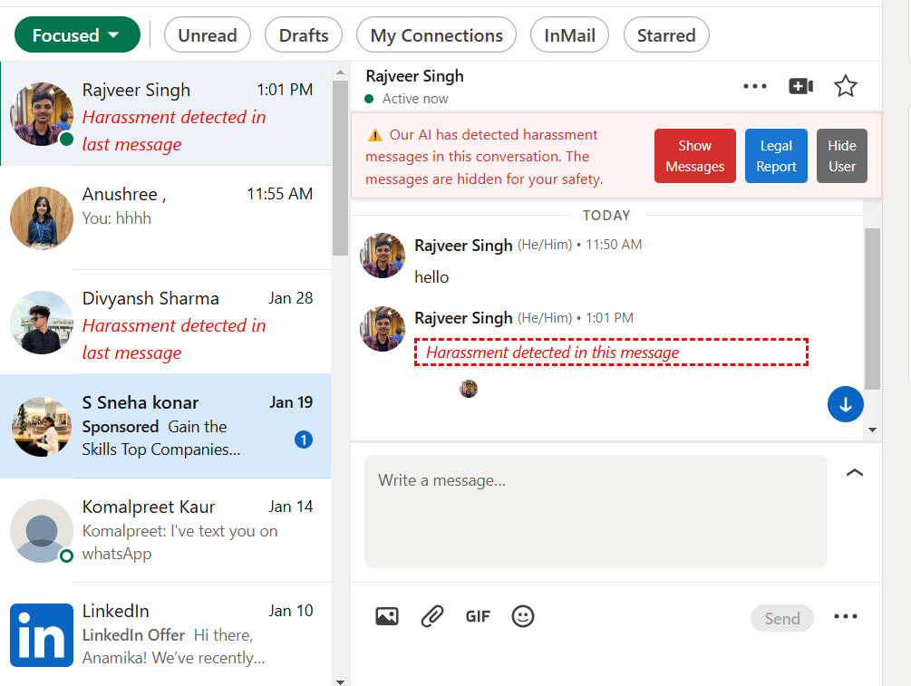
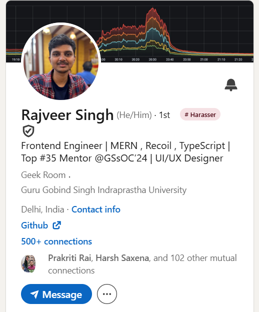
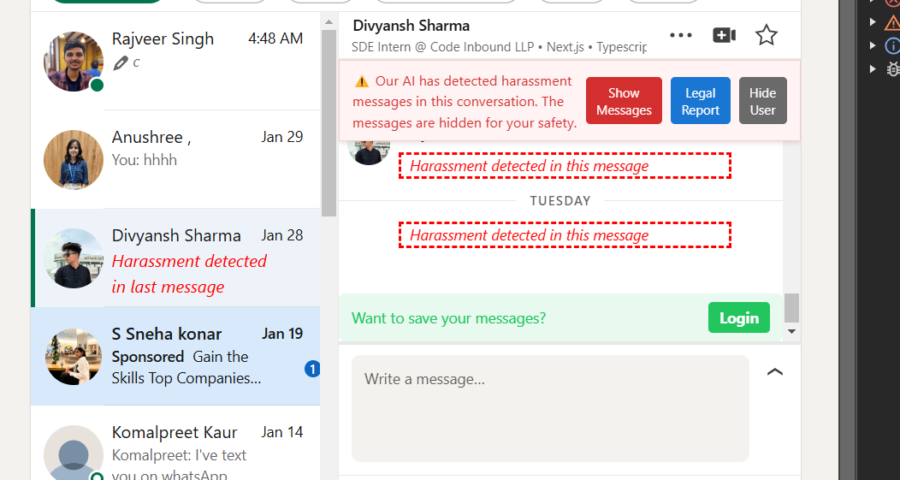

<!-- # Safire

This browser extension detects and hides harassment messages to create a safer online experience for professional platforms like LinkedIn.

## 🎥 Demo Video (click to play)

[]([https://youtu.be/P_AOuIpOxos](https://youtu.be/P_AOuIpOxos))

...
 -->

<div align="center">

  <a href="https://safire-five.vercel.app/" target="_blank">
    
  </a>

  <h1 align="center">Safire - The Harassment Saver</h1>
  <p align="center">
    A real-time, AI-powered browser extension to detect, hide, and document online harassment, 
    <br />
    creating a safer digital space for everyone.
    
  </p>


</div>

---

## 🛠 Installation

1️⃣ **Clone this repository:**  
   ```sh
   git clone https://github.com/rajveeerr/Safire.git
   ```

2️⃣ **Navigate to the project folder:**  
   ```sh
   cd Safire/extension
   ```

3️⃣ **Install dependencies:**  
   ```sh
   npm i -g pnpm
   pnpm i
   ```

4️⃣ **Start the development server:**  
   ```sh
   pnpm dev
   ```

5️⃣ **Open Chrome and navigate to:**  
   ```
   chrome://extensions/
   ```

6️⃣ **Enable Developer mode** (toggle in the top right corner).

7️⃣ **Click on Load unpacked and select the folder:**  
   ```
   Harassment-Saver-Extension/extension/build/chrome-mv3-dev
   ```

---
## 🚀 Usage

1️⃣ **Install the extension following the steps above.**  

2️⃣ **The extension will automatically detect and hide harassment messages.**  

3️⃣ **Users can manually review hidden messages if needed.**  

 ---

## Demo Video

See Safire in action. Our demo shows how we seamlessly detect harassment, hide messages, and generate legal reports in real-time.

<div align="center">
  <a href="https://youtu.be/P_AOuIpOxos" target="_blank">
    
  </a>
  <br>
  <em>(Click the thumbnail to watch the full demo on YouTube)</em>
</div>

---
<!-- ## The Problem

Online harassment is a critical social issue, disproportionately affecting women and marginalized communities. Existing anti-harassment tools are often inadequate:
- **Reactive, not Proactive**: Users experience trauma *before* any action can betaken.
- **Ineffective Blocking**: Traditional blocking can escalate the situation, as harassers simply create new accounts.
- **Lack of Evidence**: Manually collecting evidence for legal action is difficult, stressful, and often incomplete.
- **Slow Manual Reporting**: Platform reporting systems are slow and often ineffective, leaving victims unprotected.

<div align="center">
  <a href="[https://drive.google.com/file/d/1XuOpAc2S8qeLWhWpD5HGfEtjNZ-d_To4/view?usp=share_link](https://drive.google.com/file/d/1mvd4_lzI1M7y9VUbb1G4vgaDnWD7-8EO/view?usp=sharing)" target="_blank">  
     

  </a>
  <br>
  <em>Click the image above to view the full presentation</em>
</div>

---

## Our Solution: Safire

Safire is a browser extension that acts as your personal guardian against online harassment. It uses advanced AI to analyze messages in real-time, proactively hiding harmful content before you see it. Safire silently collects evidence, empowers you to take legal action, and helps create a safer online community.

<div align="center">
  <a href="https://drive.google.com/file/d/1XuOpAc2S8qeLWhWpD5HGfEtjNZ-d_To4/view?usp=share_link" target="_blank">
     
  </a>
  <br>
  <em>Click the image above to view the full presentation</em>
</div>

--- -->

## Why Safire? The Problem with Online Safety

Online harassment is more than just an inconvenience; it's a pervasive threat that silences voices and creates toxic digital environments. Existing tools are fundamentally broken—they're reactive, they escalate conflict, and they fail to empower victims. We knew there had to be a better way.

| Before Safire ❌ | With Safire ✅ |
|-------------------|----------------|
| Victims see harassing content, causing immediate trauma. | Harmful messages are **proactively hidden** before they're seen. |
| Blocking a harasser often leads to retaliation. | Our **Invisible Shield** works silently, keeping users safe. |
| Gathering evidence for legal action is a manual nightmare. | **One-click legal reports** are automatically generated. |
| You feel alone and unprotected. | **Community-driven tagging** warns others about known harassers. |

<br>

<div align="center">
  <a href="https://drive.google.com/file/d/1mvd4_lzI1M7y9VUbb1G4vgaDnWD7-8EO/view?usp=sharing" target="_blank">  
     

  </a>
  <br>
  <em>Click the image above to view the full presentation</em>
</div>

---

## Key Features

Safire is packed with features designed to provide comprehensive protection and peace of mind.

| Feature                  | Description                                                                                                                              |
| ------------------------ | ---------------------------------------------------------------------------------------------------------------------------------------- |
| 🛡️ **AI-Powered Detection**    | Utilizes Natural Language Processing (NLP) to detect both obvious and subtle forms of harassment in real-time.                         |
| 👻 **Invisible Shield**         | Automatically hides harassing messages without alerting the sender, preventing retaliation and further trauma.                       |
| 📂 **Automated Evidence**      | Captures tamper-proof screenshots with metadata (timestamps, sender details) and stores them securely for 30 days.                     |
| 📄 **One-Click Legal Reports** | Generates detailed, evidence-backed PDF reports formatted for submission to authorities or platform moderators.                        |
| 🏷️ Community-driven **Harasser Tagging**    | A visible "Harasser" tag is added beside a user's name if they have been hidden by 5+ users, creating community awareness. |
| 📊 **User Dashboard**          | A central hub to view harassment analytics, manage hidden users, customize keywords, and access generated reports.                     |
| 🌐 **Cross-Platform**          | Initially for LinkedIn, with plans to expand to Twitter, Instagram, WhatsApp, and more.                                                |

---
## Tech Stack

This project is a monorepo combining a web app, browser extension, and multiple backend services.

| Component                  | Technologies                                                                                                   |
| -------------------------- | -------------------------------------------------------------------------------------------------------------- |
| 🌐 **Landing Page**        | [React](https://reactjs.org/), [Vite](https://vitejs.dev/), [Tailwind CSS](https://tailwindcss.com/), [Framer Motion](https://www.framer.com/motion/) |
| 📊 **User Dashboard**      | [Next.js](https://nextjs.org/), [TypeScript](https://www.typescriptlang.org/), [Tailwind CSS](https://tailwindcss.com/), [shadcn/ui](https://ui.shadcn.com/) |
| 🧩 **Browser Extension**   | [Plasmo](https://www.plasmo.com/), [React](https://reactjs.org/), [TypeScript](https://www.typescriptlang.org/), [Upstash](https://upstash.com/) (for caching) |
| ⚙️ **Main Backend Server** | [Node.js](https://nodejs.org/), [Express](https://expressjs.com/), [MongoDB](https://www.mongodb.com/), [JWT](https://jwt.io/), [Puppeteer](https://pptr.dev/) |
| 🤖 **AI Moderation Server**| [Node.js](https://nodejs.org/), [Express](https://expressjs.com/), [Google Gemini AI](https://ai.google.dev/)          |

---

## Wireframes & Screenshots

We went from initial low-fidelity wireframes to a polished final product in a short amount of time.

<details>
<summary><strong>Click to view Wireframes and Screenshots</strong></summary>
<br>

**Initial Wireframes:**
<div align="center">
  <a href="https://app.eraser.io/workspace/JUmzwgvpm12ATQiWXZUU?origin=share" target="_blank">
     
  </a>
  <br>
  <em>Click the image above to view the full wireframe</em>
</div>

**Extension in Action:**
<div align="center">
     
      
      
  <br>
  <em>Harassing messages are being blocked by the extension even before the users sees them.</em>
</div>


**Dashboard UI:**
<div align="center">
  <a href="https://safe-dm-dashboard.vercel.app/" target="_blank">
    
  
  </a>
  <br>
  <em>Click the image above to create your account and view dashboard.</em>
</div>

**Generated Legal Report:**
<div align="center">
  <a href="https://drive.google.com/file/d/100yg2kfhHHoeIC910DvbznlqmIDm0tjL/view?usp=sharing" target="_blank">
     
  </a>
  <br>
  <em>Click the image above to view the full report</em>
</div>


</details>

---

## Getting Started: Local Setup

To get a local copy of Safire up and running on your machine, follow these simple steps.

### Prerequisites

- [*Node.js*](https://nodejs.org/) (v18 or higher recommended)  
- [*pnpm*](https://pnpm.io/installation)  
- [*MongoDB*](https://www.mongodb.com/)  

### Installation & Setup

#### 1. Clone the Repository

```sh
git clone https://github.com/aditya-bagret/Safire.git
cd Safire
```


#### 2. Choose a Project Component

This is a *monorepo* that contains several independent components:

| Directory            | Description                           | Setup Guide                                                  |
| -------------------- | ------------------------------------- | ------------------------------------------------------------ |
| client/            | Public-facing landing page            | [client/README.md](client/README.md)                       |
| dashboard/         | User dashboard web application        | [dashboard/README.md](dashboard/README.md)                 |
| extension/         | Chrome browser extension              | [extension/README.md](extension/README.md)                 |
| server/            | Main backend API                      | [server/README.md](server/README.md)                       |
| moderation-server/ | AI-based text moderation microservice | [moderation-server/README.md](moderation-server/README.md) |


#### 3. Set Up a Component

Navigate into the component you'd like to work on and follow its README for full setup instructions.

For example, to set up the *browser extension*, run:

sh
cd extension
pnpm install
pnpm dev


Then follow the rest of the [extension's README](extension/README.md) to load it in Chrome.


> 💡 Each component is self-contained and can be developed/tested independently.

---

<!-- ## Contributors

This project was brought to life by the team "Smooth Operators".

| Name               | GitHub Profile                               |
| ------------------ | -------------------------------------------- |
| *Aditya Sharma*  | [@aditya-bagret](https://github.com/aditya-bagret)     |
| *Anamika Raj* | [@AnamikaRaj11](https://github.com/AnamikaRaj11) |
| *pari gupta*| [@pg3010-cyber](  https://github.com/pg3010-cyber)|
| *Sugndha Agarwal*| [@SugandhaAgarwal35]( https://github.com/SugandhaAgarwal35)       |

--- -->


## The Team

This project was brought to life by the *"Smooth Operators"*.

<table>
<tr>
<td align="center">
  <a href="https://github.com/aditya-bagret">
    
    <br />
    <sub><b>Aditya Sharma</b></sub>
  </a>
</td>
<td align="center">
  <a href="https://github.com/AnamikaRaj11">
    
    <br />
    <sub><b>Anamika Rajl</b></sub>
  </a>
</td>
<td align="center">
  <a href="https://github.com/pg3010-cyber">
    
    <br />
    <sub><b>Pari Gupta</b></sub>
  </a>
</td>
<td align="center">
  <a href="https://github.com/SugandhaAgarwal35">
    
    <br />
    <sub><b>Sugandha Agarwal</b></sub>
  </a>
</td>
</tr>
</table>

---

## Submission 
## 🎥 Demo

[**Watch the Demo on YouTube**](https://youtu.be/P_AOuIpOxos)  

See Safire in action—real-time detection, hiding, and logging of harassment.


## 📄 Project Presentation

[**View the Presentation (PDF)**](https://drive.google.com/file/d/1mvd4_lzI1M7y9VUbb1G4vgaDnWD7-8EO/view?usp=sharing)  

View the complete Safire project presentation on Google Drive.

---

> [!NOTE]
> *A Note on Our Development Journey*
> 
> As a project born from the fast-paced and dynamic environment of multiple hackathons, our codebase was migrated between private repositories several times during its initial development. This was necessary to meet deadlines and adapt to evolving requirements.
> 
> Consequently, the commit history visible here doesn't fully capture the extensive, iterative process and the hundreds of commits that went into building Safire from the ground up. The current history reflects the final, polished state of the project as we prepared it for the public.
> 
> We share this note to provide context on our journey and to give a nod to the immense effort, late nights, and passion our team poured into bringing this idea to life.

---
